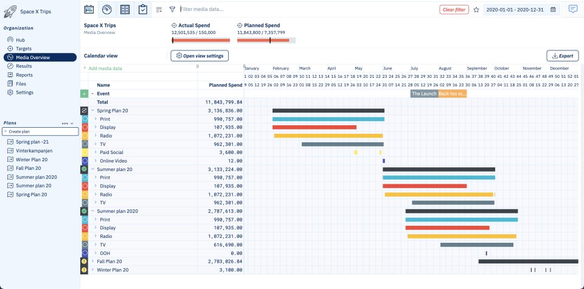

## Advanced Marketing Optimization for Complex Campaigns
In a competitive market environment, effective marketing requires precise and data-driven allocation of resources across multiple channels and campaigns. Marketing operations span diverse regions and audience segments, each with unique performance dynamics.

To maximize return on investment, a sophisticated optimization framework was developed, combining mathematical optimization techniques with machine learning-based performance forecasting. This framework enables dynamic budget allocation across channels and time periods, 
balancing immediate sales impact with long-term brand objectives.

By integrating cross-channel data and leveraging predictive analytics, the solution delivers actionable insights and automated recommendations. Decision-makers are empowered to optimize marketing spend, align campaigns strategically, and forecast outcomes confidently — driving efficiency, effectiveness, and measurable growth.

